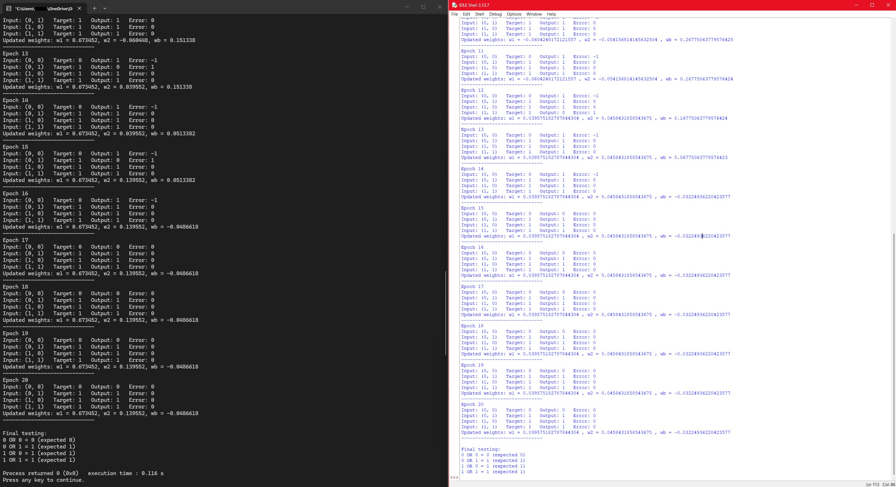

# Perceptron Implementation (Python + C++)

This project demonstrates a single-layer perceptron built from scratch in both Python and C++ to explore foundational machine learning concepts.

## Overview
The perceptron is trained on logical datasets (e.g., OR gate) using weighted inputs, a bias term, and a step activation function.

## Features
- Binary classification using a step activation function  
- Iterative training across multiple epochs  
- Weight updates based on error correction  
- Bias term to improve convergence  
- Implemented in both Python and C++ for comparison  

## Output
The model shows convergence over time, with weights stabilizing and classification errors reduced to zero.

Final testing confirms correct outputs for all OR gate input combinations.

## Technologies Used
- Python  
- C++  

## What I Learned
- How perceptrons achieve convergence  
- The impact of learning rate and bias  
- Differences in implementation between Python and C++  
## Sample Output

